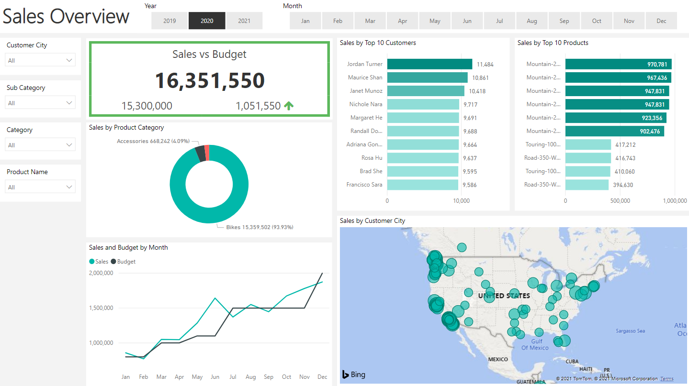
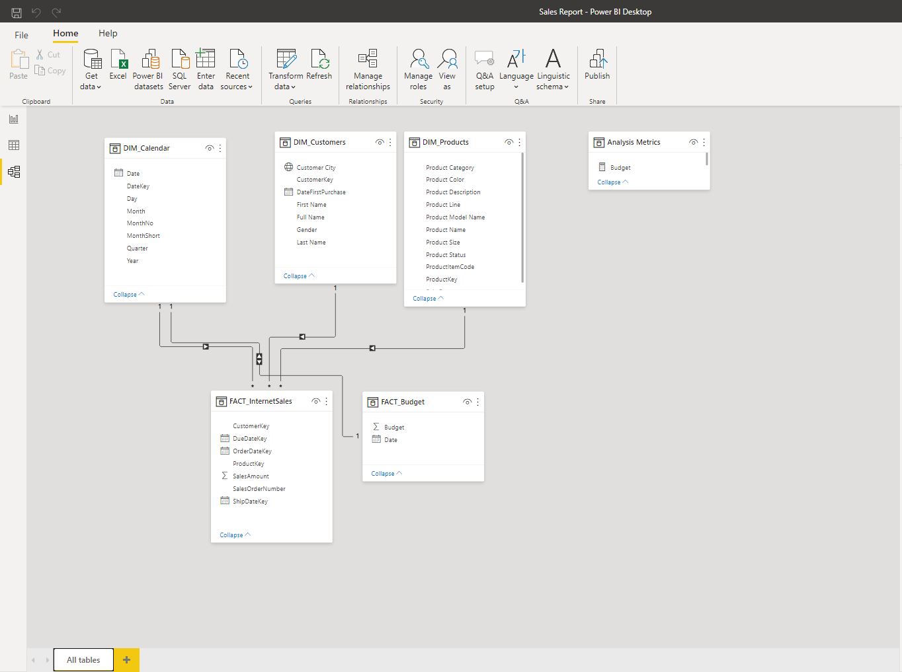
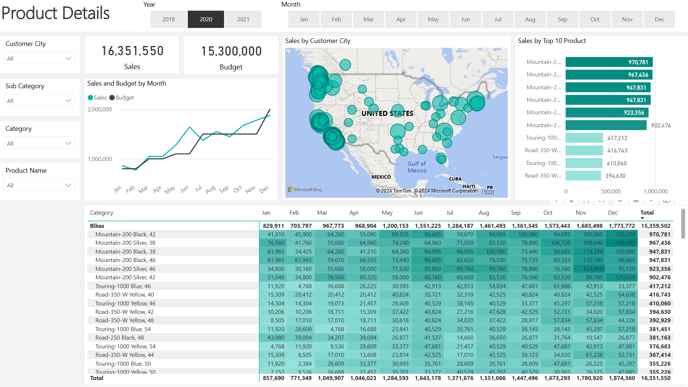
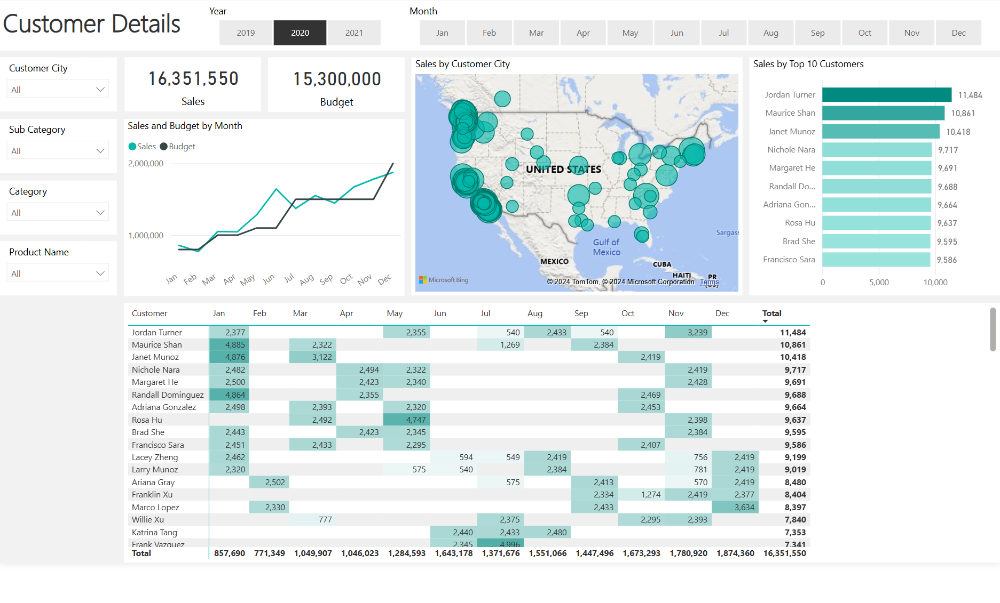

# Sales Management Data Analysis Project
<a name="readme-top"></a>
<!-- PROJECT LOGO -->
<br />
<div align="center">



<h3 align="center">Sales Management Data Analysis Project</h3>

  <p align="center">
This project involved developing a comprehensive sales management dashboard tailored to the needs of sales managers and representatives. The goal was to enhance visibility into key metrics such as customer purchasing trends, product performance, and budget tracking.
  </p>
</div>


## [Power BI Download Link 🔗](https://public.tableau.com/views/SPXGammaProfileandExposureOverview/Dashboard2?:language=en-US&:sid=&:redirect=auth&:display_count=n&:origin=viz_share_link)

<!-- TABLE OF CONTENTS -->
<details>
  <summary>Table of Contents</summary>
  <ol>
    <li>
      <a href="#about-the-project">About The Project</a>
    </li>
    <li><a href="#roadmap">Roadmap</a></li>
    <li><a href="#built-with">Built With</a></li>
  </ol>
</details>


<!-- ABOUT THE PROJECT -->
## About The Project


1. Business Request Review:
   - Analyzed business requirements and outlined key user stories to guide dashboard functionality and ensure alignment with user needs.


2. Data Cleansing and Transformation:
   - Employed SQL to cleanse and transform data from various tables, including customer, product, and sales data, ensuring data consistency and quality for analysis.
   

3. Data Modeling and Dashboard Creation:
   - Built a comprehensive data model in Power BI that integrated SQL data and additional Excel-based budget data.
   Developed a dynamic, multi-page Power BI dashboard with visualizations for overall sales, top-performing customers and products, and sales trends over time, updated daily for ongoing insights.

<p align="right">(<a href="#readme-top">back to top</a>)</p>


<!-- ROADMAP -->
## Roadmap

### 1. Business Request & User Stories
The business request for this data analyst project was an executive sales report for sales managers. Based on the request that was made from the business we following user stories were defined to fulfill delivery and ensure that acceptance criteria’s were maintained throughout the project.

| #  | Role              | Request                                      | User Value                                           | Acceptance Criteria                                               |
|----|-------------------|----------------------------------------------|------------------------------------------------------|------------------------------------------------------------------|
| 1  | Sales Manager     | To get a dashboard overview of internet sales | Can follow better which customers and products sell the best | A Power BI dashboard which updates data once a day                |
| 2  | Sales Representative | A detailed overview of Internet Sales per Customer | Can follow up with customers that buy the most and identify opportunities for more sales | A Power BI dashboard which allows me to filter data for each customer |
| 3  | Sales Representative | A detailed overview of Internet Sales per Product | Can track products that sell the most                   | A Power BI dashboard which allows me to filter data for each product |
| 4  | Sales Manager     | A dashboard overview of internet sales        | Follow sales over time against budget                   | A Power BI dashboard with graphs and KPIs comparing against budget |

<br>

### 2. Data Cleansing & Transformation (SQL)
To create the necessary data model for doing analysis and fulfilling the business needs defined in the user stories the following tables were extracted using SQL.
One data source (sales budgets) were provided in Excel format and were connected in the data model in a later step of the process.
Below are the SQL statements for cleansing and transforming necessary data.

#### DIM_Calendar:

```
-- Cleansed DIM_Date Table --
SELECT
[DateKey],
[FullDateAlternateKey] AS Date,
--[DayNumberOfWeek],
[EnglishDayNameOfWeek] AS Day,
--[SpanishDayNameOfWeek],
--[FrenchDayNameOfWeek],
--[DayNumberOfMonth],
--[DayNumberOfYear],
--[WeekNumberOfYear],
[EnglishMonthName] AS Month,
Left([EnglishMonthName], 3) AS MonthShort,   -- Useful for front end date navigation and front end graphs.
--[SpanishMonthName],
--[FrenchMonthName],
[MonthNumberOfYear] AS MonthNo,
[CalendarQuarter] AS Quarter,
[CalendarYear] AS Year --[CalendarSemester],
--[FiscalQuarter],
--[FiscalYear],
--[FiscalSemester]
FROM
[AdventureWorksDW2019].[dbo].[DimDate]
WHERE
CalendarYear >= 2019
```

#### DIM_Customers:

```
-- Cleansed DIM_Customers Table --
SELECT
c.customerkey AS CustomerKey,
--      ,[GeographyKey]
--      ,[CustomerAlternateKey]
--      ,[Title]
c.firstname AS [First Name],
--      ,[MiddleName]
c.lastname AS [Last Name],
c.firstname + ' ' + lastname AS [Full Name],
-- Combined First and Last Name
--      ,[NameStyle]
--      ,[BirthDate]
--      ,[MaritalStatus]
--      ,[Suffix]
CASE c.gender WHEN 'M' THEN 'Male' WHEN 'F' THEN 'Female' END AS Gender,
--      ,[EmailAddress]
--      ,[YearlyIncome]
--      ,[TotalChildren]
--      ,[NumberChildrenAtHome]
--      ,[EnglishEducation]
--      ,[SpanishEducation]
--      ,[FrenchEducation]
--      ,[EnglishOccupation]
--      ,[SpanishOccupation]
--      ,[FrenchOccupation]
--      ,[HouseOwnerFlag]
--      ,[NumberCarsOwned]
--      ,[AddressLine1]
--      ,[AddressLine2]
--      ,[Phone]
c.datefirstpurchase AS DateFirstPurchase,
--      ,[CommuteDistance]
g.city AS [Customer City] -- Joined in Customer City from Geography Table
FROM
[AdventureWorksDW2019].[dbo].[DimCustomer] as c
LEFT JOIN dbo.dimgeography AS g ON g.geographykey = c.geographykey
ORDER BY
CustomerKey ASC -- Ordered List by CustomerKey
```

#### DIM_Products:
```
-- Cleansed DIM_Products Table --
SELECT
p.[ProductKey],
p.[ProductAlternateKey] AS ProductItemCode,
--      ,[ProductSubcategoryKey],
--      ,[WeightUnitMeasureCode]
--      ,[SizeUnitMeasureCode]
p.[EnglishProductName] AS [Product Name],
ps.EnglishProductSubcategoryName AS [Sub Category], -- Joined in from Sub Category Table
pc.EnglishProductCategoryName AS [Product Category], -- Joined in from Category Table
--      ,[SpanishProductName]
--      ,[FrenchProductName]
--      ,[StandardCost]
--      ,[FinishedGoodsFlag]
p.[Color] AS [Product Color],
--      ,[SafetyStockLevel]
--      ,[ReorderPoint]
--      ,[ListPrice]
p.[Size] AS [Product Size],
--      ,[SizeRange]
--      ,[Weight]
--      ,[DaysToManufacture]
p.[ProductLine] AS [Product Line],
--     ,[DealerPrice]
--      ,[Class]
--      ,[Style]
p.[ModelName] AS [Product Model Name],
--      ,[LargePhoto]
p.[EnglishDescription] AS [Product Description],
--      ,[FrenchDescription]
--      ,[ChineseDescription]
--      ,[ArabicDescription]
--      ,[HebrewDescription]
--      ,[ThaiDescription]
--      ,[GermanDescription]
--      ,[JapaneseDescription]
--      ,[TurkishDescription]
--      ,[StartDate],
--      ,[EndDate],
ISNULL (p.Status, 'Outdated') AS [Product Status]
FROM
[AdventureWorksDW2019].[dbo].[DimProduct] as p
LEFT JOIN dbo.DimProductSubcategory AS ps ON ps.ProductSubcategoryKey = p.ProductSubcategoryKey
LEFT JOIN dbo.DimProductCategory AS pc ON ps.ProductCategoryKey = pc.ProductCategoryKey
order by
p.ProductKey asc
```

#### FACT_InternetSales:
```
-- Cleansed FACT_InternetSales Table --
SELECT
[ProductKey],
[OrderDateKey],
[DueDateKey],
[ShipDateKey],
[CustomerKey],
--  ,[PromotionKey]
--  ,[CurrencyKey]
--  ,[SalesTerritoryKey]
[SalesOrderNumber],
--  [SalesOrderLineNumber],
--  ,[RevisionNumber]
--  ,[OrderQuantity],
--  ,[UnitPrice],
--  ,[ExtendedAmount]
--  ,[UnitPriceDiscountPct]
--  ,[DiscountAmount]
--  ,[ProductStandardCost]
--  ,[TotalProductCost]
[SalesAmount] --  ,[TaxAmt]
--  ,[Freight]
--  ,[CarrierTrackingNumber]
--  ,[CustomerPONumber]
--  ,[OrderDate]
--  ,[DueDate]
--  ,[ShipDate]
FROM
[AdventureWorksDW2019].[dbo].[FactInternetSales]
WHERE
LEFT (OrderDateKey, 4) >= YEAR(GETDATE()) -2 -- Ensures we always only bring two years of date from extraction.
ORDER BY
OrderDateKey ASC
```

### 3. Data Model
Below is a screenshot of the data model after cleansed and prepared tables were read into Power BI.

This data model also shows how `FACT_Budget` hsa been connected to `FACT_InternetSales` and other necessary DIM tables.



### 3. Sales Management Dashboard
The finished sales management dashboard with one page with works as a dashboard and overview, with two other pages focused on combining tables for necessary details and visualizations to show sales over time, per customers and per products.





<p align="right">(<a href="#readme-top">back to top</a>)</p>

### Built With

* [![SQL][SQL]][SQL-url]
* [![Excel][Excel]][Excel-url]
* [![Power BI][PowerBI]][PowerBI-url]

<p align="right">(<a href="#readme-top">back to top</a>)</p>

[Excel]: https://img.shields.io/badge/Excel-217346?style=for-the-badge&logo=microsoft-excel&logoColor=white
[Excel-url]: https://www.microsoft.com/en-us/microsoft-365/excel
[SQL]: https://img.shields.io/badge/SQL-4479A1?style=for-the-badge&logo=postgresql&logoColor=white
[SQL-url]: https://en.wikipedia.org/wiki/SQL
[PowerBI]: https://img.shields.io/badge/Power%20BI-F2C811?style=for-the-badge&logo=power-bi&logoColor=black
[PowerBI-url]: https://powerbi.microsoft.com/

